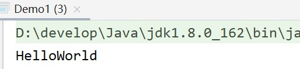
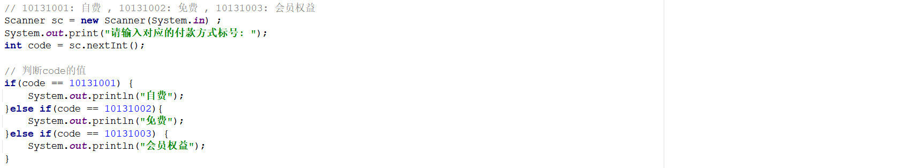
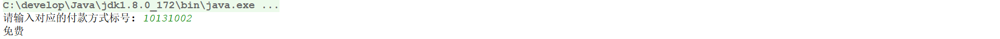

## day03作业

#### 一、选择题：

#####  1.   以下关于Object类说法错误的是（ B ）

   A. 一切类都直接或间接继承自Object类

   B. 接口也继承Object类   

   C. Object类中定义了toString()方法

   D. Object类在java.lang包中 

#####  2.  【多选题】下面关于外部类和内部类成员的相互访问的规则中，正确的选项是（ AD ）

   A. 内部类可以直接访问外部类的成员

   B. 外部类可以直接访问内部类的成员

   C. 外部类不能访问内部类的成员

   D. 外部类可通过创建内部类的实例来访问内部类的成员

 ##### 3.下面泛型定义中不正确的是（ D  ） 

   A. class Test1<T> {}

   B. interface Test2<T> {}

   C. class Test3{<T> void test () {}}

   D. class Test4{void <T> test () {}} 

##### 4. 关于下面代码，描述正确的是（ C ）

	

   A. 输出2

   B. 输出3

   C. 编译错误

   D. 运行时报异常

##### 5. 【多选题】对于泛型类class A<T> { … }，T在A类里可以用作不同的地方，在A类类体内，下面语句正确的有（ ABDG ）

```java
A. T x;
B. T m1() {return null;}
C. static T y;
D. void m2(T i) {}
E. static T s1() {return null;}
F. static void s2(T i) {}
G. static <T1> void s3(T1 i, T1 j){} 
```

##### 6. 下列关于匿名内部类的描述，错误的是（ D ）

   A.匿名内部类是内部类的简化形式

   B.匿名内部类的前提是必须要继承父类或实现接口

   C.匿名内部类的格式是"new父类(参数列表)或父接口（）{}"

   D.匿名内部类可以有构造方法

##### 7. 在java中，如下代码，编译运行后的输出结果是（ D ） 

```java
public class Demo1 {
    public int x = 1;
    private int y = 2;

    class InnerA {
        protected void methodA() {
            System.out.println("methodA");
        }

        class InnerB {
            protected void methodB() {
                double ab = x + y + z;
            }
        } 
    }
    class InnerC extends Demo1 {
        public double z = 3;
    }
}
```

   A. 编译通过，ab的值运行后为 6

   B. 编译报错，提示不能访问 x

   C. 编译报错，提示不能访问 y、x

   D. 编译报错，提示不能访问 z

##### 8. 【多选题】以下选项正确的是（ CD ）

```java
public class Demo1 {
    private int a = 10;
    // 在此处填写代码，能让代码通过编译
    ________________
}

A.
  class InnerOne{
    public static int methodA(){ // 静态方法访问不了外部实例变量
      return a;
    }
  }
B.
  private static class InnerOne {  //静态内部类只能访问静态成员
    static int methodA() {
      return a;
    }
  }
C.
  private class InnerOne{
    protected int methodA(){
      return a;
    }
  }
D. 
  abstract class InnerOne{
    public abstract int methodA();
  }
E. 
  static class InnerOne{
    protected int methodA(){
      return a;  //静态内部类只能访问静态成员
    }
  }
```

##### 9.下列关于Object类的叙述错误的是 （ D ） 

   A.Object类是所有类的父类

   B.所有类都可以继承Object中允许被继承的方法

   C.一个类没有使用extends关键字明确标识继承关系，则默认继承Object类

   D.要想继承Object类，必须使用extends关键字标识继承关系，否则不会实现继承

##### 10. 在Java中，Object类是所有类的父亲，用户自定义类默认扩展自Object类，下列选项中不属于Object类的方法的是（ C ）

   A.equals(Object obj)

   B.toString()

   C.trim()

   D.getClass()

##### 11. 【多选题】下列关于基本类型和包装类的叙述中错误的是（ BC ） 

  A. Java中的数据类型包括基本数据类型和引用类型

  B. Byte是基本数据类型

  C. 基本数据类型可以调用方法

  D. 每个基本数据类型都有对应的包装类

##### 12. 下面代码运行的正确结果是（ D ）


   A. 3

   B. 6

   C. 编译错误，无法正常运行

   D. 编译正常，但运行时产生错误    // 空指针异常

------

#### 二、今日单词：

1. 枚举关键字：enum
2. Object类中各个的方法名称：toString, clone, getClass, equals
3. JDK八种包装类类名：Byte, Integer, Character, String, Double, Float, Boolean, Long 

------

#### 三、简答题：

1. 静态内部类的加载时机？

   答：静态内部类的加载时机是在程序中调用静态内部类的时候加载的,和外部类的加载没有必然关系。

2. 什么是枚举？枚举同静态常量有何区别？

   答：枚举是一种特殊的类，枚举类第一行只能罗列枚举对象名称，这些对象是常量。
   其区别在于枚举类会有一些自己的方法，更适合用于信息分类、标记等

3. 什么是泛型？有几种泛型定义方式？

   答：泛型用<>把具体的数据类型作为参数传给类型变量,可以定义在类、接口和方法上。

4. 泛型注意事项什么？

   答：1、泛型是工作在编译阶段的，一旦程序编译成class文件，class文件中就不存在泛型了，这就是泛型擦除。
   2、泛型不支持基本数据类型，只能支持对象类型（引用数据类型）

5. 什么是浅克隆？什么是深克隆？

   答：浅克隆就是在重写时直接调用Object类中的克隆，这种方法只能克隆内存地址，并不能将该数据克隆为另外一份数据。深克隆需要自己手动重写，其意义是新建一份数据，将原有数据复制进去，这样克隆出来的对象就不再是原有对象

6. JDK提供的包装类有什么作用？

   答：泛型只能用包装类，因此包装类可以供泛型使用。而且包装类里面有一些方法，可以更好地调用。


------

#### 四、排错题：

##### 排错题1：

```java
// 以下代码是否有问题？为什么？如何解决？
// 没什么问题
public class Demo1 { 
    int c = 30;
    class Inner{
        int a = 10;
        public void show(){
            int b = 20;
            a = 100;
            b = 200;
            c = 300;
            System.out.println(a);
            System.out.println(b);
            System.out.println(c);
        }
    }
}
```

##### 排错题2：

```java
// 以下代码运行结果是什么？为什么是这个结果？
// 不知道啊！为什么是这个结果
// 查了一下：Integer类中把-128——127之间的对象缓存了，所以当声明的Integer对象的值在-128-127之间的时候，引用的是同一个对象，所以结果是true。超出这个范围，比较的是两个类的内存地址，就是false
public static void main(String[] args) {
  Integer i = 100;
  Integer i2 = 100;
  System.out.println(i == i2);  // true
  Integer i3 = 200;
  Integer i4 = 200;
  System.out.println(i3 == i4);  // false
}
```

##### 排错题3：

```java
// 以下代码是否有问题？为什么？如何解决？
// 匿名内部类中好像不能写静态方法，可以删掉static
public class Demo1 {
    public static void main(String[] args) {
        Inter i = new Inter() {
            @Override
            public void show() {
                System.out.println("匿名内部类 - show()");
            }

            @Override
            public void method() {
                System.out.println("匿名内部类 - method()");
            }

            public static void fun(){
                System.out.println("匿名内部类 - fun()");
            }
        };
    }
}
 
interface Inter{
    void show();
    default void method(){
        System.out.println("Inter - method()");
    }
    static void fun(){
        System.out.println("Inter - fun()");
    }
}
```

排错题4：

```java
// 以下代码是否有问题？为什么？如何解决？
// 好像死循环了，创建Demo1构造器内部创建Inner，Inner创建时又因为其继承了Demo1，所所以它会先用super()调用Demo1的构造器，然后陷入创建类的循环。可以把extends Demo1去掉。
public class Demo1 { 
    private class Inner extends Demo1{
        public Inner(){
            System.out.println("AAAA");
        }
    }
    public Demo1(){
        Inner i = new Inner();
        System.out.println("BBBB");
    }

    public static void main(String[] args) {
        Demo1 d = new Demo1();
    }
}
```

------

#### 五、代码题：

##### 第一题： 分析以下需求，并用代码实现

```java
interface Inter {
  void show(); 
}
class Outer { 
  //补齐代码，要求在控制台输出”HelloWorld”

}

class A implements Inter{
  public void show(){
    System.out.println("HelloWorld");
  }
}
public class OuterDemo {
  public static void main(String[] args) {
    Outer.method().show();
  }
}
```
效果展示：

 

------

##### 第二题：	分析以下需求，并用代码实现	

要求：在测试类Test中创建A的对象a并调用成员方法methodA(),要求用两种方式实现 

```java
public class Test {
  public static void main(String[] args) {	
	// 在此处完成代码
  }
}
//定义接口
interface InterA {
  void showA();	
}
class A {
  public void methodA(InterA a) {
    a.showA();		
  }	
}
```

效果演示：


------

##### 第三题：【选做题】

**训练目标**：掌握枚举的定义，以及理解其在实际开发中的应用

**需求背景**：某商场的付款类型有三种：自费、免费、会员权益。在系统中进行记录的时候，往往是通过三个标号进行表示：10131001、10131002、10131003。在给用户进行数据展示的时候，

需要展示标号所对应的中文含义。现通过程序模拟上述需求，如下所示：

|  |
| ------------------------------------------------------------ |

上述实现方式存在的弊端：代码看起来比较繁琐，可读性较差，并且不利于后期代码的维护。

**需求描述**：现需要使用枚举对上述程序进行优化。程序的执行效果如下所示：

|  |
| ------------------------------------------------------------ |

**实现提示**：

1、定义一个枚举类

2、在枚举类中定义三个枚举项(CHARGE_TYPE_CHARGED、CHARGE_TYPE_FREE、CHARGE_TYPE_MEMBER_RIGHTS)

3、在该枚举类中定义两个属性分别表示标号和付款类型的名称

4、通过构造方法完成属性的初始化

5、定义一个静态方法：根据标号获取付款名称

6、使用枚举优化上述的if...else代码


