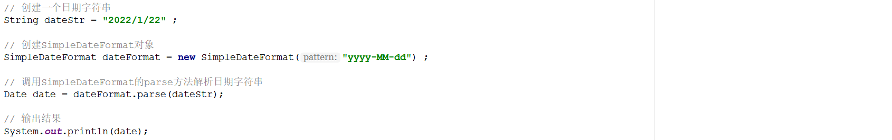
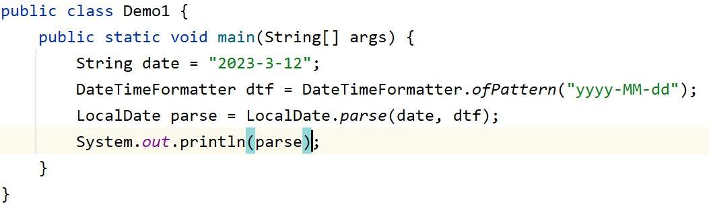
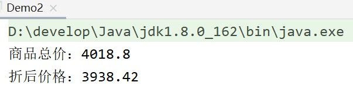
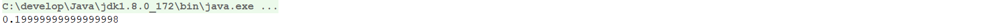
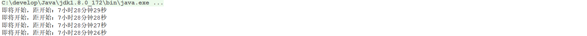
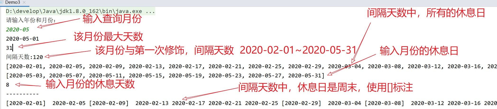

## day04作业

#### 一、今日单词：

1. 字符串拼接多个类的单词：StringBuilder,StringBuffer,StringJoiner
2. 各个工具类的单词：Object,Math,System,Runtime
3. 精确计算浮点数类的单词：BigDecimal
4. JDK 8之前的时间各个类单词：Calender,Date,SimpleDateFormat
5. JDK 后之前的时间各个类单词：LocalDate/LocalTime/LocalDateTime、ZoneID,ZoneDateTime, Instant, DateTimeFormatter,Period,Duration

------

#### 二、简答题：

1. StringBuilder有何作用？StringBuilder和StringBuffer两个类有何区别？

   答：StringBuilder对象是一个可变字符串对象，它相当于一个容器，存放可变字符串。用这个对象来操作修改字符串，比String更简洁高效。StringBuilder是线程不安全的。
   StringBuffer与StringBuilder的方法是一样的，但它是线程安全的。多个用户一起操作的时候就用StringBuffer。

2. 为什么java中的时间零点是"1970-01-01 00:00:00"？那我们中国也是这个时间么？

   答：查了一下，最早出现的UNIX操作系统考虑到计算机产生的年代和应用的时限综合取了1970年1月1日作为UNIX TIME的纪元时间(开始时间)，java起源于UNIX系统，所以java自然也遵循了这一约束。在我们中国应该是"1970-01-01 08:00:00"，因为中国在东八区比标准时间早八个小时。

3. 分别说出：Date、SimpleDateFormat、Calendar类的作用？

   答：Date可以获取系统当前时间数据（周 月 日 时 分 秒 时区 年）
   Calender类可以获取系统当前时间对应的日历，通过这个日历对象可以获取更多的时间信息（包括时区等等）。、
   
   SimpleDateFormat是简单日期格式化，它可以将Date对象数据（或毫秒值）转变为指定的格式。也可以根据指定的格式来解析时间字符串，把它写到Date数据里面

4. 分别说出：LocalDate、ZoneId、ZonedDateTIme、Instant、DateTimeFormatter、Period、Duration类的作用？

   答：LocalDate 代表本地日期（年 月 日 星期）；

      ZoneId 时区的id （洲名-城市名/ 国家名-城市名）

      ZoneDateTime 带时区的时间

      Instant 可以拿到从1970-01-01 00:00:00开始走到现在的总秒数+不够一秒的纳秒数

      DateTimeFormatter  格式化器，和简单日期格式化相似但搭配LocalTimeDate，用于时间的格式化，解析 ，且线程安全

      Period 计算日期间隔（年 月 日）

      Duration 计算时间间隔（时 分 秒 纳秒）

------

#### 三、简答题：

排错题1：请说明下述程序执行完毕以后在控制台的输出结果是什么并说明原因？

答：解析失败。因为格式和字符串的格式不一致。如果要解析这个字符串，应该使用“yyyy/MM/dd”.

排错题2：请说明下述程序执行完毕以后在控制台的输出结果是什么并说明原因？

答：经过测试发现，程序执行后会报错，原因是3无法与MM匹配，因为MM默认月份是两个字符，需要写成03，如果要用不补全位数的月份，则可以将MM改成M。

------

#### 四、代码题：

##### 第一题： 分析以下需求，并用代码实现

**训练目标**：掌握Java中BigDecimal的使用

**需求描述**：已知手机的价格是3999, 钢化膜的价格是9.9, 店家促销策略为: 满4000打98折.   现在小明买了一台手机和两块钢化膜, 请问小明应该付多少钱(精确到分)？

**案例执行效果如下所示**：

------

##### 第二题： 分析以下需求，并用代码实现

**训练目标**：掌握Java中BigDecimal的使用

**需求描述**：日常开发中，浮点数参数运算场景不少，但是java中浮点数在运算时往往不够精确，所以需要别的方式来解决，请并且给出精确输出(得到结果为0.2)的代码！

 |
| ------------------------------------------------------------ |

**案例执行效果如下所示**：

|  
| ------------------------------------------------------------ |

------

##### 第三题：	分析以下需求，并用代码实现	

**训练目标**：掌握Java中SimpleDateFormat以及Date的使用，以及理解其在实际开发中的应用

**需求背景**：秒杀是网上竞拍的一种新方式，指商家在网络平台发布一些超低价格的商品，让所有买家在同一时间抢购的一种销售方式。由于商品价格非常低廉，通常活动时间一到，商品就会被买

家抢购一空，有时甚至只用一秒钟，所以该种方式被称为秒杀。在秒杀活动页面往往会有一个倒计时的功能，如下图所示：

|  |
| ------------------------------------------------------------ |

**需求描述**：请在素材的seckill项目的指定位置补全相关的代码，实现秒杀倒计时的功能！秒杀开始时间为：明天的06时0分0秒。

案例执行效果如下所示：

|  |
| ------------------------------------------------------------ |

**实现提示**：

1、在TimeTask类中补全代码

2、在TimeTask的构造方法中初始化秒杀开始时间

3、在TimeTask的run方法中，获取当前系统时间，然后计算当前系统时间与秒杀开始时间相差的毫秒值

4、然后将毫秒值转换成对应的时、分、秒

------

##### 第四题：时间相关的处理

**训练目标**：掌握JDK 8以前版本时间类的使用。

**需求描述**：

	1. 已知日期字符串:"2015-10-20",将该日期字符串转换为日期对象；
	2. 将(1)中的日期对象转换为日历类的对象；
	3. 根据日期对象获取该日期是星期几,以及这一年的第几天
	4. 通过键盘录入日期字符串，格式(2015-10-20)

​	如输入：2015-10-20，输出"2015年-10月-20日 是 星期二，是2015年的第 293 天"

------

##### 第五题：【选做题】

**训练目标**：掌握JDK 8时间类的使用。

**需求背景**：某林业工人孙工，作息规律为上三天班，休息一天，经常不确定休息日是否是周末。为此，请你开发一个程序，当孙工输入年以及月，以日历方式显示对应月份的休息日，用中括号进行标记（可以查看以前的休息情况和将来的休息情况）。同时，统计出本月有几天休息，轮到周末休息有几天。（注：首次休息日是2020年2月1日）

**需求描述**：

1.将输入的年份和月份传入LocalDate类，找到该月份的最大天数

2.计算输入月份月末-首次休息日的间隔天数

3.计算间隔天数中的休息日并放入集合中

4.在间隔天的休息日中找到该查询月份的休息日并放入集合中

5.计算该月休息日的天数

**案例执行效果如下所示：**

注意：最终展示效果不一定要完全相同，能满足题目需求即可。

