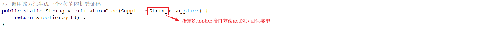

## day05作业

#### 一、选择题：

##### 1. 下列对于Lambda表达式的格式 ( 形式参数 ) -> { 代码块 ) 说法错误的是 ( B ) 

​    A. Lambda表达式必须作用在函数式接口上

​    B. 形式参数：如果有多个参数，参数之间用分号隔开；如果没有参数，留空即可

​    C. ->：由英文中画线和大于符号组成，固定写法。代表指向动作

​    D. 代码块：是我们具体要做的事情，也就是以前我们写的方法体内容


##### 2. 下列对于Lambda表达式的省略模式说法错误的是( D )

   A. 参数类型可以省略，但是有多个参数的情况下，不能只省略一个

   B. 如果参数有且仅有一个，那么小括号可以省略

   C. 如果代码块的语句只有一条，可以省略大括号和分号和return，不能只省略一个

   D. Lambda的指向箭头->可以省略

##### 3.【多选题】下列关于Lambda表达式说法正确的是（BCD）

   A.当一个接口中有多个抽象方法的时候，可以通过Lambda表达式来重写其中的方法 X

   B.可以通过::来传递Arrays.sort () 

   C.由于Lambda表达式是表示重写某个抽象方法，因此参数列表不可省略

   D.当Lambda表达式的函数体只有一句的时候，可以省略return不写

##### 4. 下列对于Arrays.sort()方法说法正确的是（C）

   A. sort(T[] arr,Comparator c)方法可以对任意类型数组排序 

   B. sort(T[] arr,Comparator c)方法只能对数组进行升序排序

   C. sort(T[] arr,Comparator c)方法只能对引用类型数组排序

   D. sort()方法没有重载，参数是Object，就可以接受任意类型数组 // Comparator泛型接口只能传引用类型

##### 5.  【多选题】下面代码要正常运行，哪个选项正确（CD）

```java
interface Inter{
    void show();
}
public class Demo2 {
    public static void main(String[] args) {
        Inter i = new Inter() {
            @Override
            public void show() {
                System.out.println("你好！");
                System.out.println("我是Lambda！");
            }
        };
        method(i);
        // 想要达到上面相同的效果，选择哪个调用方式？
        method(??);
    }
    public void funA(){
      System.out.println("你好！");
      System.out.println("我是Lambda！");
    }
    public static void funB(){
      System.out.println("你好！");
      System.out.println("我是Lambda！");
    }
    public static void method(Inter i){
        i.show();
    }
}
-----------------------------------------
A. 
  method(Demo2::funA); 
B.
  Demo2 d = new Demo2();
  method(d::funB);
C.
  method(Demo2::funB); 
D. 
  Demo2 d = new Demo2();
  method(d::funA);
```

##### 6. 下面代码会导致编译错误的选项是（ D ）

```java
interface Inter{
    int[] show(int len);
}
public class Demo1 {
    public static void main(String[] args) {
        Inter i = new Inter() {
            @Override
            public int[] show(int len) {
                return new int[len];
            }
        };
        method(i);
        method(int[]::new); 
    }
   
    public static void method(Inter i,int len){ 
        i.show(len);
    }
}
-----------------------------------
A.
   Inter i = new Inter() {
      @Override
      public int[] show(int len) {
         return new int[len];
      }
   };
   method(i,3);
B.
   Inter i = a -> new int[a]; 
   method(i,0);
C.
   method(int[]::new,3);
D.
   method(new int[a],3);
```

##### 7. 下面针对数组排序算法，描述错误的是（C）

   A. 冒泡排序：元素两两比较，较大的元素会同相邻的小元素交换位置。

   B. 选择排序：每轮选择当前位置，开始找出后面的较小值与该位置交换。

   C. 冒泡排序是排序算法中效率最高的排序算法。

   D. 选择排序算法比冒泡排序算法，排序效率高。//选择排序在确定一个位置时只需要交换一次，冒泡可能交换多次

##### 8. 【多选题】能够完全匹配字符串"back"和"back-end"的正则表达式包括（ _**ABCD**_ ）

   A. `'\w{4}-\w{3}|\w{4}'` ：// !（\w{4}-\w{3}）或（\w{4}）

   B. `'\w{4}|\w{4}-\w{3}'`：

   C.`'\S+-\S+|\S+'` : 

   D. `'\w*-\w*|\w*'`

##### 9. 【多选题】能够完全匹配字符串"(010)-62661617"和"01062661617"的正则表达式包括（_**ABD**_） 

   A. `"\(?\d{3}\)?-?\d{8}"`

   B. `"[0-9()-]+"` ：

   C. `"[0-9(-)]*\d*"`       //! 这个-如果在两个字符之间，就被解读成“到”，这里的[]里只包含0~9、(、)，只能像B一样写在最后面！

   D.`"[(]?\d*[)-]*\d*"`

------

#### 二、今日单词：

1. 数组工具类的单词：Arrays
2. 函数式接口的单词：FunctionalInterface
3. 方法引用的单词：::
4. 冒泡排序方法的单词：Arrays.sort
5. 二分查找方法的单词：Arrays.binarySearch

------

#### 三、简答题：

1. 如何使用Arrays工具类实现数组的降序排序？

   答：可以用匿名内部类重写compare方法来定义，用Lambda表达式可以简化。
   也可以自定义静态方法，在Lambda表达式中调用，该方法可以用方法引用 类名::静态方法名 简化书写。
   若自定义实例方法，也可以在Lambda表达式中调用，方法引用书写方式为 对象::实例方法


2. 什么是面向函数式编程？同面向对象编程有何区别？

   答：面向函数式编程强调将计算过程看作是函数之间的转换而不是状态的改变。函数可以像变量一样传递和使用，可以作为参数传递给其他函数或作为返回值返回。
   面向对象编程则强调将某一类的数据以及他们的行为封装成对象，强调的是数据和对数据操作的封装。

3. 请说明lambda表达式'()->{}'每个符号的含义？

   答：（）里面是被重写的方法的参数列表，-> 表示调用函数式接口
   {}里面是重写的方法的代码块

4. 什么是方法引用？什么情况下可以使用方法引用？

   答：方法引用::是用来进一步简化Lambda表达式的。如果某个Lambda表达式里只是调用一个静态方法，并且前后参数的形式一致，就可以使用静态方法引用（类名::方法名）。如果Lambda表达式里只是调用一个实例方法，并且前后参数形式一致，就可以使用实例方法引用（对象::方法名）。如果某个Lambda表达式里只是调用一个实例方法，并且前面参数列表中的第一个参数是作为方法的主调，后面的所有参数都是作为该实例方法入参的，则此刻就可以使用特定类型方法引用（类型::方法）。如果某个Lambda表达式里只是在创建对象，且前后参数一致，就可以用构造器引用（类名::new）

5. 请说出冒泡排序和选择排序的排序原理？

   答：冒泡排序是每次选定最前面的一个数据，将它与后面相邻的数据比较，如果更大则换个顺序，再与后面相邻的数据比较，这样每次交换遍历完一遍数据，就能将最后那个位置的数据确定下来，类似于在剩下的数据中将最大的数据通过冒泡冒出去。
   选择排序则是每次选定最靠前的一个位置，通过将数据依次与其他数据比较，每次选择更小的，来选出这个位置的数据。每次遍历可以按顺序确定一个位置的数据。

6. 正则表达式区分语言吗？有何作用？

   答：不区分语言，泛用性更高（？）


------

#### 四、排错题：

##### 排错题1：

```java
// 以下代码是否有问题？为什么？如何解决？
// <>泛型里面只能放类名，不能放int，要用这个匿名内部类的话，可以把数组转成Integer数组，然后再用Comparator<Integer>来做。
public class Demo1 { 
    public static void main(String[] args) {
        int[] arr = {5, 2, 3, 1, 4};
        Arrays.sort(arr, new Comparator<int>() {
            @Override
            public int compare(int o1, int o2) {
                return o2-o1;
            }
        });
        System.out.println(Arrays.toString(arr));
    }
}
```

##### 排错题2：

```java
// 下面代码是否能使用二分查找法，正确找到元素5的位置？如果不能，如何解决？
// 不能，二分查找必须在有序的数组中使用，在第一次比较中位数3<5后，下次的查找范围就会变成后面一半，找不到5了。需要先将数组排序，再用二分查找。
public class Demo2 {
  public static void main(String[] args) {
    int[] arr = {5, 2, 3, 1, 4};
    int index = Arrays.binarySearch(arr, 5);
    System.out.println(index);
  }
}
```

##### 排错题3：

```java
// 以下代码是否有问题？为什么？
// 没问题，因为@FunctionalInterface标注的接口默认继承Object类，toString继承Object类方法不算抽象方法
public class Demo1 {
    public static void main(String[] args) {
        Inter i = new Inter() {
            @Override
            public void show() {
                System.out.println("匿名内部类 - show()");
            }
        };
        i.show();
    }
}
@FunctionalInterface
interface Inter{
    void show();
	String toString();
}
```

##### 排错题4：


上面lambda表达式的书写是否正确并说明原因？并给出正确的代码！

答：省略参数类型要么都省略，要么都不省略。
正确代码：show((a, b) -> a + b);

------

#### 五、代码题：

##### 第一题：分析以下需求，并用代码实现

**训练目标**：掌握Java中数组排序，以及理解其在实际开发中的应用

**需求描述**：某学校要组织学生参加活动，要求学生按照身高从小打大进行排队。请在素材的sort项目中的Entry类中补全相关的代码，模拟排队效果！程序运行效果如下所示：

|  |
| ------------------------------------------------------------ |

**实现提示**：

1、使用冒泡排序比较两个学生的身高

2、再次使用选择排序比较两个学生的身高


------

##### 第二题：	分析以下需求，并用代码实现	

**训练目标**：掌握Java中lambda表达式的使用

**需求背景**：在注册网站用户的时候，大部分的网站都会先生成一个随机的验证码展示给用户，用于区分正常人和机器的操作。如下图所示：

|  |
| ------------------------------------------------------------ |

**需求描述**：在素材的supplier项目的Entry类的指定位置补全代码(调用verificationCode方法)，实现一个生成四位随机验证码! 案例的执行效果如下所示：

|  |
| ------------------------------------------------------------ |

**实现提示**：

1、Supplier<T>是一个生产类型接口，该接口的方法`T get();`是需要在方法内部生产一个T类型的对象返回。

2、verificationCode方法参数Supplier<String>说明如下所示：

|  |
| ------------------------------------------------------------ |

3、生成验证码的字符可以从OPTIONS_CAHS中获取

4、调用verificationCode方法获取一个4位的随机验证码

------

##### 第三题：分析以下需求，并用代码实现

**训练目标**：掌握Java中lambda表达式的使用

**需求描述**：在素材的function项目中指定的位置补全代码，实现从userNames数组中随机获取一个元素返回(点名器)! 案例的执行效果如下所示：


**实现提示**：

1、Function<T,R>是一个转换类型接口，该接口的方法`R apply(T t);`是将传入对象T类型，转换成R类型并返回。

2、getUserName方法参数Function<String[] , String>说明如下所示：


3、使用lambda表达式完成getUserName方法调用

------

##### 第四题：【选做题】分析以下需求，并用代码实现

**训练目标**：掌握Java中二分查找代码的思想，以及在实际开发中的应用

**需求背景**：某公司的技术部门年会需要举行一个抽奖活动以感谢员工在这一年中的付出。奖品种类总共有4种：一等奖、二等级、三等奖、谢谢惠顾。为了节约成本需要控制每一种奖项的抽取概

率，常见的做法就是给每一个奖项分配一个int类型的权重值，权重越大抽取到的概率就越大。下图是具体的奖项权重值分配情况：

|  奖项  | 一等奖  | 二等奖  | 三等奖  | 谢谢惠顾 |
| :--: | :--: | :--: | :--: | :--: |
|  权重  |  1   |  2   |  3   |  4   |

**需求描述**：请在素材的lottery项目中Entry类中补全相关代码，完成按照权重随机抽奖程序的设计。多次运行程序(100次)，执行完毕以后在控制台的输出部分结果如下所示：

|  |
| ------------------------------------------------------------ |

**实现提示**：

1、所有奖项的总权重，以及每一个奖项的权重范围 , 如下所示：

|  奖项  |  一等奖  |  二等奖  |  三等奖  |  四等奖   |
| :--: | :---: | :---: | :---: | :----: |
| 权重范围 | [0,1) | [1,3) | [3,6) | [6,10) |

2、生成一个随机数作为权重数

3、利用二分查找根据权重数从奖项数组中获取对应的奖项

4、控制台输出奖项名称


