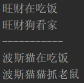

## day01作业

#### 一、选择题：

**1、关于static的说法错误的是(  A )**

A.每一个类中至少定义一个静态的成员变量
B.每一个类中可以定义多个静态的成员变量
C.静态的加载优先于对象,随着类的加载而加载
D.被static修饰的成员变量属于类，这个类的所有对象都可以使用

**2、在Java语言中,下列关于类的继承的描述,正确的是( C )** //不好意思做着做着忘了选正确的

A.子类可以继承父类的所有内容,包括构造器、方法和属性
B.子类中不能出现和父类一模一样的成员方法
C.一个类可以同时继承多个父类
D.一个类可以有多个子类

**3、【多选题】关于继承的描述, 正确的是( ABC )**

A.如果子类父类中出现不重名的成员变量，这时的访问是没有影响的
B.如果子类父类中出现重名的成员变量，这时的访问是有影响的,访问本类的成员变量使用 this,访问父类的成员变量使用 super
C.如果子类父类中出现不重名的成员方法，这时的调用是没有影响的
D.子类中不能出现和父类一模一样的成员方法


**4.  下面描述方法重写错误的是（ C ）**// 父类中被private权限修饰的方法不会被子类继承，自然也不会被重写

   A. 要有子类继承或实现

   B. 子类方法的权限必须大于等于父类的权限

   C. 父类中被private权限修饰的方法可以被子类重写

   D. 子类重写父类的方法, 重写的方法名和形参列表必须与父类一致

**5. 试图编译运行下面的代码会发生什么情况（ _D_ ）** 

```java
public class MyClass{
    static int i;    
    public static void main(String[] args){
    	System.out.println(i);
    }
}
```

   A. 错误，变量i没有被初始化

   B. 输出null

   C. 输出1

   D. 输出0

**6. 【多选题】下面对static的描述正确的是（ ACD ）** 

   A. 静态修饰的成员变量和成员方法随着类的加载而加载

   B. 静态修饰的成员方法可以访问非静态成员变量   

   C. 静态修饰的成员可以被整个类对象所共享

   D. 静态修饰的成员变量和成员方法随着类的消失而消失

**7. 以下代码运行结果是什么（A）**


```tex
A.
	Static-A执行了  -->  构造器-C执行了  -->  Static-B执行了  -->  
    代码块-A执行了  -->  构造器-A执行了  -->  代码块-B执行了  -->  
    构造器-B执行了
B. 
	Static-A执行了  -->  Static-B执行了 --> 构造器-C执行了 -->
    代码块-A执行了 --> 构造器-A执行了 --> 代码块-B执行了 -->
    构造器-B执行了
C.
	Static-A执行了  -->  Static-B执行了  -->  构造器-C执行了  -->  
    构造器-A执行了  -->  代码块-A执行了  -->  构造器-B执行了  -->  
    代码块-B执行了
D. 
    构造器-C执行了  -->  Static-A执行了   -->  Static-B执行了  -->  
    构造器-A执行了  -->  代码块-A执行了   -->  构造器-B执行了  -->  
    代码块-B执行了
```

**8.  给定Java程序Child.java的代码如下所示，则编译运行该类的结果是（ _C_ ）**

```java
class Parent {
    public Parent() {
        System.out.println("parent");
    }
}
public class Child extends Parent {
	public Child(String s) {
        System.out.println(s);
    }
    public static void main(String[] args) {
        Child child = new Child("child");  
    }
}
```

   A. child

   B. child
       parent

   C. parent
       child

   D. 编译错误

**9. 【多选题】下面关于变量及其范围的陈述哪些是对的? (  AD )**

A. 成员变量在创建对象时被初始化。

B. 实例变量用关键字static声明。

C. 静态变量使用前，必须赋值。

D. 静态变量在类加载时被初始化。

**10. 给定两个java程序，如下：**

```java
public class Face{   
	public static int counter = 40;     
}       
public class Test extends Face {   
	private static int counter;    
	public static void main(String[]args){ 
      	System.out.println(++counter);         
	}     
}    
```

Test.java 的编译运行结果是（ D ）。 

    A. 40  

​    B. 41  

​    C. 0  

​    D. 1

**11. 【多选题】单例模式的实现必须满足（ ACD ）个条件** 

   A. 类中的构造器的访问权限必须设置为私有的

   B. 类中的构造器必须用protected修饰

   C. 必须在类中创建该类的静态私有对象

   D. 在类中提供一个公有的静态方法用于创建或者获取静态私有对象

**12.  Java中，如果类C是类B的子类，类B是类A的子类，那么下面描述正确的是（ A  ）** 

   A. C可以继承B中的公有成员，同样也可以继承A中的公有成员

   B. C只继承了B中的成员

   C. C只继承了A中的成员

   D. C不能继承A或B中的成员

------

#### 二、今日单词：

1. 静态单词：static
2. 单例单词：single instance
3. 继承单词：extend
4. 重写单词：override
5. 四种权限修饰符单词：public private protected /

------

#### 三、简答题：

1. static可以用来修饰什么？各自有何特点？

   答：成员变量和成员方法，随着类加载而加载，可以被所有实例对象调用。静态变量用于为所有实例对象提供一份数据。
   

2. static注意事项有哪些？

   答：1.静态方法可以直接访问类的成员，不可以访问实例成员；2.静态方法不可以用this关键字来获取变量；3.static{}是静态代码块，只在类加载时被执行一次。
   * 被static修饰的变量在多线程的情况下需要注意安全。

3. 单例设计模式是什么意思？什么是懒汉式？什么是饿汉式？

   答：一个类只有一个实例的意思。懒汉式是等到创建对象的适合才创建唯一一个实例对象。饿汉式是先实例化好单例，创建的时候直接拿这个单例。

4. 代码块有几种？分别有何特点和作用？

   答：两种。静态代码块和实例代码块
   静态代码块在类加载时被执行一次。用于静态变量初始化。
   实例化代码块在实例化对象时执行，执行顺利在构造器之前。作用与构造器类似，可以用来记录日志

5. 继承是什么？为什么要在程序中使用继承？

    答：子类继承父类，可以使用父类的变量和方法，并在自己的类中定义自己的变量和方法。
    **在程序中使用继承能提高代码的复用率，提高了代码的可读性，也能帮助实现多态。

6. 方法重写和方法重载是什么样的？

    答：方法重写就是子类重写父类的方法，方法名和参数列表需要一致，该方法的访问权限要大于等于父类的。
    方法重载应该是一样的方法名，但不同传参列表，可以进行方法重载。

7. 子类构造器有什么特点？

    答：子类构造器会先运行父类的无参构造器，其第一行隐含的代码为super();如果父类没有无参构造，需要自己写自己传参。

8. this和super有哪些作用？

    答：this指向本类的本个实例，super指向它继承的父类

------

#### 四、排错题：

##### 排错题1：

```java
// 以下代码是否有问题？为什么？如何解决？
class Ye{
   public void add(){
  	   System.out.println("Ye - add()");
   }
}
class Fu extends Ye {
   public void show(){
  	   System.out.println("Fu - show()");
   }
}
class ErShu extends Ye {
   public void method(){
  	   System.out.println("Mu - method()");
   }
}
class Zi extends Fu{
   public void test(){
       add();  // Ye - add()
       show();  // Fu - show()
       method(); // Mu - method() 这个用不了，因为没有继承ErShu这个类
   }
}
```

##### 排错题2：

```java
// 以下代码是否有问题？为什么？如何解决？
class A {
    int a_a = 10;
    static int a_b = 20;
}
class B extends A{
    int b_a = 100;
    static int b_b = 200; 

    public static void show(){ 
        System.out.println(super.a_a); // **不应该出现super关键字
        System.out.println(this.b_a);   // 这里静态方法应该拿不到成员变量b_a
        System.out.println(a_b);  // 父类的成员变量，应该也拿不到
        System.out.println(b_b);
    }
}
```

------

#### 代码题：

##### 第一题：分析以下需求，并用代码实现

```tex
1.定义项目经理类 
	属性：
		姓名 工号 工资 奖金
	行为：
		工作work
2.定义程序员类
	属性：
		姓名 工号 工资
	行为：
		工作work
3.要求:向上抽取一个父类,让这两个类都继承这个父类,共有的属性写在父类中，子类重写父类中的方法
	编写测试类:完成这两个类的测试
```
效果演示：


代码：
```java
public class father {
    // 姓名 工号 工资
    //	行为：	    工作work

    String name;
    String id;
    double money;

    public void work(){
        System.out.println("work");;
    }

    public father(String name, String id, double money) {
        this.name = name;
        this.id = id;
        this.money = money;
    }
}

public class Maneger extends father{
    double reword;

    public void work(){
        System.out.println("工号为：" + id + "的项目经理" + name + "，拿着" + money +"工资和" +
                reword + "奖金， 正在看程序员写代码");
    }

    public Maneger(String name, String id, double money ,double reword) {
        super(name, id, money);
        this.reword = reword;
    }
}

public class Programmer extends father{

    public Programmer(String name, String id, double money) {
        super(name, id, money);
    }

    public void work(){
        System.out.println("工号为：" + id + "的程序员" + name + "，拿着" + money +"工资," +
                " 正在写代码");
    }
}


public class Test {
    public static void main(String[] args) {
        Maneger maneger = new Maneger("小江", "123", 200, 200);
        Programmer programmer = new Programmer("陈姐", "666", 200000);

        maneger.work();
        programmer.work();

    }

}

```

------

##### 第二题:  编程题

请使用继承定义以下类:

```java
狗(Dog)
  成员变量: 姓名,颜色,价格
  成员方法: 吃饭,看家

猫(Cat)
  成员变量: 姓名,颜色,价格
  成员方法: 吃饭,抓老鼠
```

将狗和猫相同的内容(姓名,颜色,价格,吃饭)抽取到父类Animal中

按步骤编写代码，效果如图所示： 


编写步骤：

1. 定义父类Animal类,添加姓名,年龄,价格成员变量,添加吃饭方法
2. 定义Dog类继承Animal类,添加看家方法
3. 定义Cat类继承Animal类,添加抓老鼠方法
4. 在测试类中，创建Dog对象,并设置成员变量的值,调用Dog对象的eat,lookHome方法.创建Cat对象,并设置成员变量的值,调用Cat对象的eat,catchMouse方法

```java
public class Animal {
    // 定义父类Animal类,添加姓名,年龄,价格成员变量,添加吃饭方法

    String name;
    int age;
    double price;

    public void eat(){
        System.out.println( name + "在吃饭");
    }

    public Animal(String name, int age, double price) {
        this.name = name;
        this.age = age;
        this.price = price;
    }
}

public class Cat extends Animal{
    public Cat(String name, int age, double price) {
        super(name, age, price);
    }
    // 定义Cat类继承Animal类,添加抓老鼠方法

    public void catchMouse(){
        System.out.println(name + "在抓老鼠");
    }
}


public class Dog extends Animal{
    public Dog(String name, int age, double price) {
        super(name, age, price);
    }
//    定义Dog类继承Animal类,添加看家方法

    public void lookHome(){
        System.out.println("在看家");
    }
}

public class Test {
    public static void main(String[] args) {
        //在测试类中，创建Dog对象,并设置成员变量的值,调用Dog对象的eat,lookHome方法.创建Cat对象,并设置成员变量的值,调用Cat对象的eat,catchMouse方法

        // 因为写getter和setter方法的话代码太长了所以我用了构造器，大概是这个意思嗯嗯嗯
        Dog dog = new Dog("陈姐", 18, 9999.99);
        dog.eat();
        dog.lookHome();

        Cat cat = new Cat("yjf", 23, 9999.99);
        cat.eat();
        cat.catchMouse();


    }
}
```

------

##### 第三题：【选做题】	分析以下需求，并用代码实现	

	定义银行卡：主卡和副卡类，完成下列功能
	1、完成银行卡-主卡的存取款方法
	  主卡卡有余额，卡号，户主等属性
	  有存款和取款的方法（取款时候余额不足要有提示）
	2、完成银行卡-副卡的取款方法
	  副卡额外有透支额度属性(副卡可用主卡中余额，且余额不够，可以透支额度)
	  副卡重写取款方法（取款时候余额不足要有提示）
	3、写测试案例，分别测试主卡和副卡的存取款功能（存取款后显示余额） 
效果演示：


```java
public class MainCard {
    //	1、完成银行卡-主卡的存取款方法
    //	  主卡卡有余额，卡号，户主等属性
    //	  有存款和取款的方法（取款时候余额不足要有提示）

    private String id;
    private String master;
    private double money;

    public void save(double m){
        money += m;
        System.out.println("主卡存款" + m +",当前余额：" + money);
    }

    public void get(double m){
        if (money < m){
            System.out.println("主卡余额不足！无法取款");
        }else {
            money -= m;
            System.out.println("主卡取款成功，当前余额：" + money);
        }
    }

    public MainCard(String id, String master, double money) {
        this.id = id;
        this.master = master;
        this.money = money;
    }

    public String getId() {
        return id;
    }

    public void setId(String id) {
        this.id = id;
    }

    public String getMaster() {
        return master;
    }

    public void setMaster(String master) {
        this.master = master;
    }

    public double getMoney() {
        return money;
    }

    public void setMoney(double money) {
        this.money = money;
    }

    @Override
    public String toString() {
        return "银行卡-主卡{" +
                "id='" + id + '\'' +
                ", master='" + master + '\'' +
                ", money=" + money +
                '}';
    }
}


public class SecondCard extends MainCard{
    //	2、完成银行卡-副卡的取款方法
    //	  副卡额外有透支额度属性(副卡可用主卡中余额，且余额不够，可以透支额度)
    //	  副卡重写取款方法（取款时候余额不足要有提示）

    private double owe;

    public SecondCard(String id, String master, double money) {
        super(id, master, money);
    }

    public void get(int m){
        if (super.getMoney() < m){
            owe = m - super.getMoney();
            super.setMoney(0);
            System.out.println("副卡-取款成功！透支额度：" + owe);
        }else{
            super.setMoney(super.getMoney() - m);
            System.out.println("副卡-取款成功，当前余额：" + super.getMoney());
        }
    }

    @Override
    public String toString() {
        return "银行卡-副卡，余额：{" +
                "id='" + super.getId() + '\'' +
                ", master='" + super.getMaster() + '\'' +
                ", money=" + super.getMoney() +
                "owe=" + owe +
                '}';
    }
}

public class Test {
    public static void main(String[] args) {
        //	3、写测试案例，分别测试主卡和副卡的存取款功能（存取款后显示余额）
        MainCard mainCard = new MainCard("123", "陈姐", 10000);
        mainCard.setMoney(1000);
        System.out.println(mainCard);

        mainCard.get(500);
        mainCard.get(5000);

        SecondCard secondCard = new SecondCard("123", "陈姐", 10000);
        secondCard.setMoney(1000);
        System.out.println(secondCard);

        secondCard.get(5000);

    }
}
```
