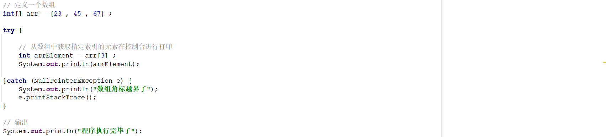
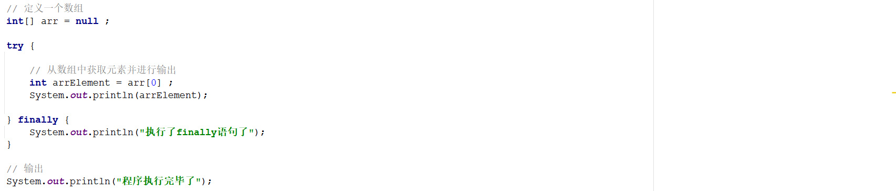
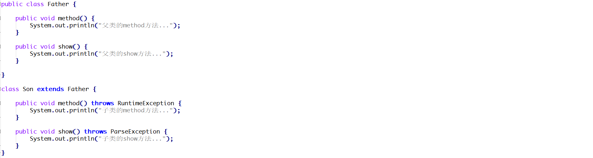
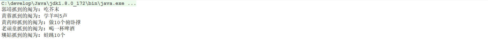
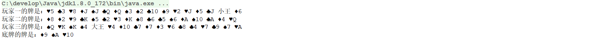
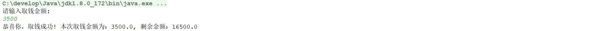
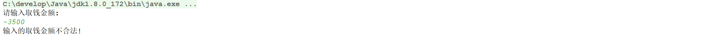
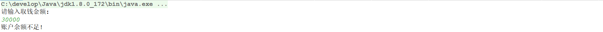

##  day06作业

#### 一、选择题：

#####   1.  Java语言中异常的分类是哪项（ B ） 

   A. 运行时异常和异常

   B. 编译异常和运行异常

   C. 错误和异常

   D. 错误和运行时异常

##### 2. 所有异常的父类是哪项（ D ）

```java
public class Demo4 {
    public static void main(String[] args) {
        try {
            System.out.print (Integer.parseInt("forty")) ;
        } catch (RuntimeException r){
            System.out.print ("runtime");
        } catch (NumberFormatException e){
            System.out.print( "number");
        } 
    }
}
```

   A. number

   B. runtime

   C. fortnumber

   D. 编译错误   // RuntimeException包括NumberFormatException

##### 3．【多选题】关于try...catch...finally 结构，描述正确的是哪项?（ AC ）

   A. 可以有多个catch

   B. 只能有一个catch

   C. 可以没有catch

   D. finally必须有

##### 4. 下面代码运行结果是（ B ） 

```java
public class Demo4 extends Utils {
    public static void main(String[] args) {
        try {
            System.out.print(new Demo4().getlnt("42"));
        } catch (NumberFormatException n) {
            System.out.println("NFEXc");
        }
    }
    int getlnt(String arg) throws NumberFormatException {
        return Integer.parseInt(arg);
    }
}

class Utils {
    int getlnt(String arg) {
        return 42;
    }
}
```

   A. NFExc

   B. 42

   C. 42NFExc

   D. 编译报错

##### 5. 下面代码，为使代码通过编译，需要在哪一行加入代码 `throws Exception` （ D ） 

```java
 public class Demo4  {
    public static void main(String[] args) { // 加在这里？
        new Demo4().topGo();
    }

    public void topGo() { // 加在这里？
        middleGo();
    }

    public void middleGo() { // 加在这里？
        go();
        System.out.println("late middle");
    }

    public void go() { // 加在这里？
        throw new Exception();
    }
 }
```

   A．只在第10行

   B．在第6行和第10行

   C．在第6行、第10行和第15行

   D．在第2行、第6行、第10行和第15行

##### 6. 关于迭代器说法错误的是(  D  ) 

   A.  迭代器是取出集合元素的方式  

   B.  迭代器的hasNext()方法返回值是布尔类型

   C.  List集合有特有迭代器   // 为什么是特有迭代器？不是很普通的迭代器吗 

   D. next()方法将返回集合中的上一个元素

##### 7. 下面代码运行的结果是(  A  ) 

```java
ArrayList<String>al = new ArrayList<String>();
al.add(true);
al.add(123);
al.add(“abc”);
System.out.println(al);
```

  A.  编译失败  

  B.  [true,123]

  C.  [true,123,abc];

  D.  [abc];

 ##### 8. ArrayList的初始化内容如下：

```java
ArrayList<String> list = new ArrayList<>();
list.add("java");
list.add("aaa");
list.add("java");
list.add("java");
list.add("bbb");
```

下面可以删除list中所有的“java”的代码是（ A ）

```java
A.   // 从前往后删应该可以
for (int i = list.size()-1; i >= 0; i--) {
			if("java".equals(list.get(i))){
				list.remove(i);
			}
	}  
B. // 从前往后，因为删除后索引变化问题，所以肯定不行
for (int i =0; i < list.size(); i++) {
			if("java".equals(list.get(i))){
				list.remove(i);
			}
	}
C.  list.remove("java");
D.  list.removeAll("java");   // 这个方法的参数是匿名内部类
```

##### 9. 【多选题】List集合的遍历方式有如下哪几种 ( ABC ) 

   A.  Iterator迭代器实现   

   B.  增强for循环实现

   C.   get()和size()方法结合实现   

   D.  get()和length()方法结合实现

##### 10. 题示代码的功能为：对于一个存放Person对象的ArrayList进行循环遍历。并输出每个Person对象的idCard和userName，那么位置①处的代码为（ D ）

```java
class Person {
    private Long idCard;
    private String userName;
    // 以下是getter和setter方法  		
    // 省略 
}
public class Demo4 {
    public static void main(String[] args) {   
        List<Person> list = new ArrayList<>();
        Person p1 = new Person();
        p1.setIdCard(new Long(1001));
        p1.setUserName("terry");
        Person p2 = new Person();
        p2.setIdCard(new Long(1002));
        p2.setUserName("tom");
        list.add(p1);
        list.add(p2);
        for (位置① ){
            System.out.println(person.getIdCard() + ":" + person.getUserName());
        }
    }
}
```

   A.  List list : person  

   B. List list : Person  

   C. Person person : List  

   D. Person person : list  

##### 11. 下面代码的运行结果是（ D ）

```java
public class Demo4 {
    public static void main(String[] args) {  
        ArrayList al = new ArrayList();
        al.add("a");
        al.add("b");
        al.add("c");
        Iterator it = al.iterator();
        while(it.hasNext()){
          String s = (String)it.next();
          if(s.equals("c")){
          al.add("c1");
        }
    }
}
System.out.println(al);
```

   A. [a,b,c]

   B. [c1]

   C.  [a,b,c,c1]

   D. 抛出ConcurrentModificationException异常

 ##### 12. 【多选题】Java中的集合类包括ArrayList、LinkedList等类，下列关于集合类描述正确的是（ ABD ） 

   A.  ArrayList和LinkedList均实现了List接口

   B.  ArrayList的查询速度比LinkedList快  // ArrayList基于数组实现（查询快、增删慢）

   C.  插入添加和删除元素时，ArrayList的表现更佳

   D.  在末尾追加元素效率，LinkedList比ArrayList高

------

#### 二、今日单词：

1. 异常体系所涉及的各个类的单词：RuntimeException、FileNotFoundException、ParseException
2. 抛出异常单词：throws Exception
3. 制造异常单词：? throw new RuntimeException
4. 集合体系各个接口单词：Collection, List, Set
5. 集合体系各个实现类单词： ArrayList, LinkedList, HashSet, LinkedHashSet, TreeSet

------

#### 三、简答题：

1. 什么是异常？为什么要有这么多异常类？

   答：异常，程序出现的问题，用它及孩子类封装程序问题。运行时异常是RuntimeException及其孩子类，不同的异常类标志不同的程序错误，可以更快地纠错。

2. 异常的体系结构涉及到哪些类？并说明各个类？

   答：java.lang.throwable下有两个分支：error和exception。
        error：系统级别错误（不是给程序员用的）;
        Exception：异常，程序出现的问题，用它及孩子类封装程序问题
        RuntimeException运行时异常：RuntimeException及其子类，编译时不发生错误提醒，运行时错误（例如：数组越界）
        ParseException编译时异常：编译时就会出现错误提醒（如：日期解析异常）

3. 集合的体系结构中List接口和Set接口有和区别？

   答：List接口的集合有序，可以有重复，有索引。Set接口下的集合无序，不可重复，无索引。

4. 什么是迭代器？什么是并发修改异常？如何解决？

   答：迭代器是一种通用的设计模式，提供了一种安全的方式遍历集合。
   并发修改异常指的是在并发环境下，当方法检测到对象的并发修改，但不允许这种修改时，抛出该异常。（即在使用迭代器进行遍历时，修改集合中的元素）

5. 请简述ArrayList集合的底层数据结构，以及特点？

   答：ArrayList底层是基于数组实现的，内存地址是连续的。它的特点是查询快、增删慢。适合数据量大，且经常需要随即索引的。

6. 请简述LinkedList集合的底层数据结构，以及特点？

   答：LinkedList基于双链表实现，它的特点是查询慢，增删相对快。对首尾元素进行增删改查非常快


------

#### 四、排错题：

##### 排错题1：

```java
// 以下代码是否有问题？为什么？如何解决？
// 会发生并发修改异常。因为迭代同时删除集合元素会对迭代器有影响，可以使用迭代器自己的remove()方法。在代码中只要将list.remove(str)改为it.remove(str)
public class Demo1 { 
    public static void main(String[] args) {
         List<String> list = new ArrayList();
        list.add("aa");
        list.add("bb");
        list.add("bb");
        list.add("bb");
        list.add("cc");
        list.add("bb");
        list.add("bb");
        list.add("dd");

        Iterator<String> it = list.iterator();
        while(it.hasNext()){
            String str = it.next();
            if(str.equals("bb")){
                list.remove(str);
            }
        }
        System.out.println(list);
    }
}
```

##### 排错题2：

请分析如下程序执行完毕以后在控制台的输出结果是什么并说明原因？



答：控制台输出“数组角标越界了”，并打印红字异常信息。
因为捕捉到了这个异常，程序中断，执行catch代码块的内容。捕捉到异常后程序不再往下执行，最后的输出是执行不了的。

##### 排错题3：

请分析如下程序执行完毕以后在控制台的输出结果是什么并说明原因？



答：控制台输出“执行了finally语句”。因为执行try代码块时出现异常，程序终止，直接执行finally里面的代码后结束。

##### 排错题4：

下述程序编译能否通过？如果不能，请说明哪一个方法会报错并说明原因？



答：不能编译通过，因为ParseException是编译时错误。该代码中无相关编译异常信息可以抛出

------

#### 五、代码题：

##### 第一题：分析以下需求，并用代码实现

**训练目标**：掌握Java中List集合的使用，以及理解其在实际开发中的应用

**需求背景**："抓阄"是指每人从预先做好记号的纸卷或纸团中摸取一个，以决定做什么。比如：学羊叫5声、蛙跳10个、吃芥末、喝一杯啤酒、做10个俯卧撑等。

**需求描述**：请设计一个抓阄游戏程序，实现5个人的抓阄，程序的运行效果如下所示：

|  |
| ------------------------------------------------------------ |

**实现提示**：

1、创建一个集合存储5个人的名称

2、创建一个集合存储5个阄的内容

3、遍历名称的集合，获取每一个参与人员的名称

4、生成一个随机数作为存储5个阄的集合的索引，从该集合中随机获取一个元素，并且删除获取到的元素

5、在控制台输出结果

------

##### 第二题：	分析以下需求，并用代码实现	

**训练目标**：掌握Java中List集合的使用，以及理解其在实际开发中的应用

**需求背景**："斗地主"游戏是大家都比较喜欢的游戏。游戏规则：本游戏为三人游戏，一副牌54张，每人17张，留3张做底牌，在确定地主之前玩家不能看底牌。确定地主后，地主可获得3张底牌。

|  |
| ------------------------------------------------------------ |

**需求描述**：请在素材的landlords项目的Entry类中指定位置补全相关代码，实现斗地主的发牌以及看牌功能。案例效果如下所示：

|  |
| ------------------------------------------------------------ |

**实现提示**：

1、创建四个List集合对象，分别用来存储3个玩家的牌以及底牌

2、遍历牌盒将合适的牌存储到上述指定的集合中

3、看牌就是对集合的元素进行遍历

4、【选做】对每人手上的牌进行排序，从小到大的方式.[3,4,5,6,7,8,9,10,J,Q,K,A,2,王]

------

##### 第三题：【选做题】分析以下需求，并用代码实现

**训练目标**：掌握Java中自定义异常的使用，以及理解其在实际开发中的应用

**需求背景**：为了减轻银行柜台业务员的工作量，银行一般情况下都会提供ATM机，供用户办理一些简单业务(存钱、取钱)。在取钱的时候需要输入取钱的金额，ATM系统校验通过以后，对用户的

余额进变更，ATM机吐钱！并且在成功界面展示余额！素材中的atm项目是模拟银行ATM机的取钱操作。初始化的余额为20000元，程序的运行结果如下所示：

正常操作：

|  |
| ------------------------------------------------------------ |

非正常操作：

|  |
| ------------------------------------------------------------ |

**需求描述**：现需要对程序加入取钱金额的校验逻辑，程序的运行结果如下所示：

|  |
| ---------------------------------------- |
|  |

**实现提示**：

1、校验逻辑应该放在AtmServiceImpl中的drawMoney方法中实现

2、提示信息应该放Entry类中(因为是直接和用户进行交互)

3、可以考虑自定义异常


