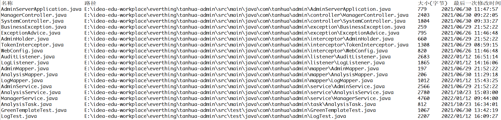

##  day08作业

#### 一、选择题：

#####   1. 【多选题】下列关于Stream流中获取功能有哪些( ACD )   

​    A. Collection接口中的默认方法stream()生成流

​    B. Map接口中的默认方法stream()生成流   // 使用entrySet转成Map.Entry数据

​    C. Arrays中的静态方法stream生成流

​    D. Stream类中of方法生成流

##### 2. 【多选题】下列关于Stream流中中间功能有哪些( ABD )

​    A. filter()方法用于对流中的数据进行过滤

​    B. sorted()方法将流中元素进行排序

​    C. collector()方法收集流中的数据   

​    D. limit()方法截取指定参数个数的数据

##### 3. 【多选题】下列关于Stream流中终结功能有哪些( _ABD_ )  

​    A. forEach()方法对流中的元素遍历

​    B. count()方法返回此流中的元素数

​    C. skip()方法跳过指定参数个数的数据

​    D. collector()方法收集流中的数据   // 不应该是collect吗？Collector是接口名

##### 4. 观察以下Stream流代码,最终输出的结果为( A )

```java
public class Test {
    public static void main(String[] args) {
        ArrayList<String> list = new ArrayList<>();
        Collections.addAll(list, "张三丰", "张翠山", "张无忌", "张三", "赵四");
        long count = list.stream().filter(s -> s.length() == 3).skip(2).count();
        System.out.println(count);
    }
}
```

​    A. 1

​    B. 2

​    C. 张翠山 , 张无忌

​    D. 张无忌

#####  5.【多选题】下列关于File类的描述中,哪些是错误的( CD )

   A. File类用于封装一个路径,这个路径可以是从系统盘符开始的绝对路径,也可以是相对于当前目录而言的相对路径    // 准确来说应该是当前模块目录下

   B. File类用于封装一个路径,所以该类没有相关的IO流操作 

   C. File类的listFiles()方法返回值是一个字符串    //File[]

   D. File类属于java.lang包   // io包

##### 6. 下列叙述中，错误的是( B ) 

   A．File类能够存储文件

   B．File类能够读写文件

   C．File类能够建立文件

   D．File类能够获取文件、文件夹信息

##### 7. 可以用来描述文件或者文件夹的类是（ A ）

   A.  File 

   B.  FileStream

   C.  OutputStream

   D.  FileReader

##### 8. 获取指定目录下所有的文件，可以通过哪个方法实现（ D ） 

   A.   list（）

   B.   getDir();

   C.   listFile()

   D.   listFiles()

##### 9.  下列对递归描述正确的是（ C ）

   A. 递归效率很高，所以平时尽量使用  // ?

   B. 递归不一定要有出口，没有出口，内存不够了，也会自动停下来   // ?

   C. 递归就是方法自己调用自己

   D. 只要有出口，递归次数不限

##### 10. 【多选题】实现Map接口的两个类分别采用什么数据结构来实现（ AC ） 

   A. HashMap采用哈希表来实现Map接口

   B. HashMap采用维护有序数组的方法来实现Map接口

   C. TreeMap采用有序的红黑树树来实现Map接口

   D. TreeMap采用二叉树来实现Map接口

------

#### 二、今日方法：

1. Map集合中的常用方法名，以及方法功能：

    * size() 获取集合大小; 
    * clear() 清空集合; 
    * isEmpty() 判断是否为空。
    * get(Object key) 根据键key获取对应value,返回的是value的类型
    * remove(Object key) 根据键key删除对应键值对，把该键的value返回
    * containKey(Object key)  判断是否包含某个键
    * containValue(Object value)  判断是否包含某个值
    * keySet() 获取全部键，返回一个set集合
    * values()   获取全部的值，返回一个Collection集合
    * 集合1.putAll(集合2)    把Map集合的数据倒入另一个Map集合中去
    * map.entrySet()  将“键值对”封装成键值对类型（Map.Entry类型）
 

2. Stream流中的常用方法名，以及方法功能：

* 中间方法：
   * filter(Predicate<? super T> predicate) 过滤
   * sorted() 排序
   * sorted(Comparator<? super T> comparator) 排序
   * limit(long maxSize) 获取前几个元素
   * skip(long n) 跳过前几个元素
   * distinct()  去除流中重复的元素
   *  map(Function<? super T, ? extends R> mapper)  对元素加工，并返回对应的新流
   * concat(Stream a, Stream b) 合并a和b为同一个流
* 终结方法：
   * forEach(Consumer action) 对此流运算后的元素执行遍历
   * count()  统计此流运算后的元素个数
   * max(Comparator<? super T> comparator) 获取此流运算后的最大值元素
   * min(Comparator<? super T> comparator) 获取此流运算后的最小值元素
   * collect(Collector collector) 把流处理后的结果收集到指定集合去
   * toArray() 把流处理后的结果放到一个数组里去


3. File对象中的常用方法名，以及方法功能：

* 获取文件信息
   * exists(): 判断文件对象是否存在
   * isFile(): 判断当前文件对象指代的是否是文件
   * isDirectory(): 判断当前文件对象是否指代的是文件夹
   * getName(): 获取文件的名称（含后缀）
   * length()： 获取文件大小，返回字节数
   * lastModified(): 获取文件最后修改时间
   * getPath(): 获取创建文件对象时，使用的路径
   * getAbsolutePath(): 获取绝对路径
* 创建和删除
   * createNewFile(): 创建一个新文件
   * mkdir(): 创建文件夹，只能创建一级文件夹
   * mkdirs(): 创建文件夹，可以创建多级文件夹
   * delete(): 删除文件，或者空文件夹，注意：不能删除非空文件夹
* 遍历文件夹
   * list(): 获取当前目录下所有的 一级文件名称 到一个字符串数组
   * listFiles(): 获取当前目录下所有的 一级文件对象 到一个文件对象数组中去返回
------

#### 三、简答题：

1. HashMap和LinkedHashMap集合有何区别？什么情况下使用哪种集合？

   * 区别：HashMap无序，LinkedHashMap是有序的，它采用了双向链表来维护数据插入的顺序。
   * HashMap增删改查性能都比较好，如果不在乎数据的顺序并且对数据增删改查比较频繁，就用HashMap。如果希望数据能够按插入顺序排列，则用LinkedHashMap

2. Stream流是什么？用来干什么的？

   * Stream流是JDK8开始新增的一套api，可以操作集合或者数组的数据

3. Stream流有哪些特点？

   * Stream流大量的结合了Lambda的语法风格来编程，代码更简洁，可读性更好

4. Stream流和IO流是一样的吗？分别用来干什么的？

   * 不一样。
   * Stream流是用来操作集合或者数组的数据的
   * IO流是用来操作读写文件或者网上的数据的

5. File类用来干什么的？

   * File类用来操作文件，它的实例对象代表一个文件或者文件夹。File类可以对文件或文件夹进行操作。包括获取文件属性信息，创建、删除以及遍历文件等。

6. 什么是递归？需要注意什么？

   * 递归是一种编程思想，指当前方法调用自己
   * 注意事项：
      * 确保有一个及以上的终止条件，否则会陷入无限循环
      * 递归次数不能太多，否则会栈内存溢出
   


------

#### 四、排错题：

##### 排错题1：

```java
// 以下代码是否能正常运行？如果不能为什么？如何解决？
public class Demo3 {
    public static void main(String[] args) {
        List<Integer> list = List.of(6, 3, 4, 5, 1, 2);
        Stream<Integer> stream = list.stream();
        stream.sorted((o1, o2) -> o2 - o1);
        stream.forEach(System.out::println);
    }
}
```


* 不能，因为在执行sorted操作后没有接收返回的流，原本的sorted流无法在使用。
* 解决1：定义流接收后再用forEach输出：
```java    
   Stream<Integer> stream1 = stream.sorted((o1, o2) -> o2 - o1);
   stream1.forEach(System.out::println);
```
* 解决2：链式编程输出
```java    
   stream.sorted((o1, o2) -> o2 - o1).forEach(System.out::println);
```


##### 排错题2：

```java
// 以下代码是否能正常运行？如果不能为什么？如何解决？
class Student {          // 学生类
    private String name;       // 学生姓名
    private int height;        // 学生身高
    // 以下省略set/get/toString/构造方法。
}
public class Demo3 {
    public static void main(String[] args) {
        Student s1 = new Student("郭靖", 175);
        Student s2 = new Student("黄蓉", 155);
        Student s3 = new Student("黄药师", 180);
        Student s4 = new Student("欧阳锋", 170);
        Student s5 = new Student("穆念慈", 160);
        List<Student> list = List.of(s1, s2, s3, s4, s5);
        // 需要将集合中的Student对象，按照下面需求完成代码：
        // 1. 先将身高不足160的学生过滤
        // 2. 再按照年龄进行降序排序
        // 3. 最后将name属性，拼接成一个字符串，之间使用'-'隔开
        Stream<Student> stream1 = list.stream().filter(s -> s.getHeight() >= 160);
        Stream<Student> stream2 = stream1.sorted((o1, o2) -> o1.getHeight() - o2.getHeight());
        String collect = stream2.collect(Collectors.joining("-"));
        System.out.println(collect); 
    }
}
```
```java
答：不能，首先要求降序排列，题中所给出的是升序。其次，collect方法的返回值是集合，不能直接拼成字符串。可以用先收集成对象数组，再遍历数组，按格式要求输出字符串。
    也可以将倒数第二行代码改成：String collect = stream2.map(Student::getName).collect(Collectors.joining("-"));
```


##### 排错题3：

```java
// 以下代码是否能正常运行？如果不能为什么？如何解决？
class Student {          // 学生类
    private String name;       // 学生姓名
    private int height;        // 学生身高
    // 以下省略set/get/toString/构造方法。
}
public class Demo4 {
    public static void main(String[] args) {
    	// 要求map按照中的数据，按照学生的年龄进行降序排序。
        Map<String,Student> map = new TreeMap<>(new Comparator<Student>() {
            @Override
            public int compare(Student o1, Student o2) {
                return o2.getHeight() - o1.getHeight();
            }
        });
        Student s1 = new Student("郭靖", 175);
        Student s2 = new Student("黄蓉", 155);
        Student s3 = new Student("黄药师", 180);
        Student s4 = new Student("欧阳锋", 170);
        Student s5 = new Student("穆念慈", 160);
        map.put("南京",s1);
        map.put("上海",s2);
        map.put("长沙",s3);
        map.put("西安",s4);
        map.put("成都",s5);
        
        map.forEach((k,v)-> System.out.println(k+" - " + v));
    }
}
```

```java
答：TreeMap是按照Key的值排序的，这里的比较器定义无效。可以把Map中的key和value调换一下。
```

##### 排错题4：


请说明下面程序执行完毕以后在控制台的输出结果是什么？并说明原因？

```java
答：结果是报错，因为没有规定对象的比较器。TreeSet要对key值进行排序，但是没有定义顺序。
```


------

#### 五、代码题：

##### 第一题：分析以下需求，并用代码实现

**训练目标**：掌握File对象的使用

**需求描述**：完成以下需求：【以下的每一问之间，没有任何联系】

	1. 键盘录入一个新文件夹路径判断该路径是否存在
	- 如果存在，则什么都不做
	- 如果不存在，则创建该文件夹
	2. 键盘录入一个路径，并将该路径指向的文件或文件夹删除；【别瞎玩】
	3. 获得指定文件夹下所有的java文件(不考虑子文件夹的)并输出到控制台
	4. 统计任意一个文件夹的大小 （length()方法可以获取文件的大小）
	5. 键盘录入一个路径，将指定路径下的小于200K的小文件，并打印

------

##### 第二题：	分析以下需求，并用代码实现	

**训练目标**：掌握JDK1.8的新特性Stream流的基本使用，熟悉常用的API

**需求背景**：

```tex
以下是某不知名机构2020年，评出的全球最佳影片及华人最佳影片前十名 ：
全球
    第1名：《肖生克的救赎》，豆瓣评分：9.7
　　第2名：《霸王别姬》豆瓣评分：9.6
　　第3名：《阿甘正传》，豆瓣评分：9.6
　　第5名：《辛德勒的名单》豆瓣评分：9.6
　　第5名：《美丽人生》豆瓣评分：9.5
　　第6名：《千与千寻》，豆瓣评分：9.4
　　第7名：《泰坦尼克号》，豆瓣评分：9.4
　　第8名：《这个杀手不太冷》，豆瓣评分：9.4
　　第9名：《忠犬八公的故事》，豆瓣评分：9.4
　　第10名：《盗梦空间》，豆瓣评分：9.3

华人
　  第1名：《阳光普照》，豆瓣评分：8.5
　　第2名：《气球》豆瓣评分：7.9
　　第3名：《拆弹专家2》，豆瓣评分：7.9
　　第4名：《一秒钟》，豆瓣评分：7.8
　　第5名：《送你一朵小红花》豆瓣评分：7.5
　　第6名：《金都》，豆瓣评分：7.7
　　第7名：《叔叔》，豆瓣评分：7.7
　　第8名：《八佰》，豆瓣评分：7.6
　　第9名：《夺冠》，豆瓣评分：7.3
　　第10名：《我和我的家乡》，豆瓣评分：7.3
```

**需求如下**：
1、现将两个榜单中的[影片名]以及[豆瓣评分]，分别按排名顺序依次存入两个Map集合。

​	影片名 - key
​	豆瓣评分 - value

2、通过流的方式	

​	1）打印全球影片排行榜中的前三甲影片名

​	2）打印华人影片排行榜中倒数5名的影片名

​	3）将两个排行榜中的前5名挑出来共同存入新的集合

​	4）定义电影Film类(属性：电影名，评分)，将上面新集合中的数据，封装到Film对象中。

------

##### 第三题：分析以下需求，并用代码实现

**训练目标**：掌握Java中递归算法的使用

**需求描述**：小姑娘采蘑菇问题，小姑娘第一天摘下若干个蘑菇，当即吃了快一半，还不过瘾，又多吃了一个。第二天又将仅剩下的蘑菇吃掉了一半，又多吃了一个。以后每天都吃了前一天剩下的一半多一个。到第十天，只剩下一个蘑菇。试求第一天共摘了多少蘑菇？

**实现提示**：

1、可以采用假设法，先推导出具体的规则

2、使用递归算法进行实现

------

##### 第四题：【选做题】分析以下需求，并用代码实现

**训练目标**：掌握java中File的基本使用，以及理解其在实际开发中的应用

**需求背景**：当电脑磁盘上存储的文件越来越多的时候，要从系统中查找某一个文件就变的比较麻烦。为了快速从磁盘上找的某一类文件，此时就可以借助于类似于Everything这样的文件搜索工具

实现文件的搜素。如下所示，就是借助于Everything搜素本地磁盘上所有以.java结尾的文件的效果：

|  |
| ------------------------------------------------------------ |

**需求描述**: 现通过程序模拟Everything搜索工具搜索效果，在素材everthing项目中的指定位置补全代码实现搜索功能。案例的实现效果如下所示：

|  |
| ------------------------------------------------------------ |

**实现提示**：

1、需要使用到递归算法，遍历文件夹中所有的文件

2、控制台输出内容对齐可以调用padRight方法通过补全字符的方式进行实现，用户查看体验好

```java
 /**
     * 右侧补字符
 */
public static String padRight(String origin, int length, char ch) {
  while (origin.length() < length) {
    origin = origin + ch;
  }
  return origin;
}
```


